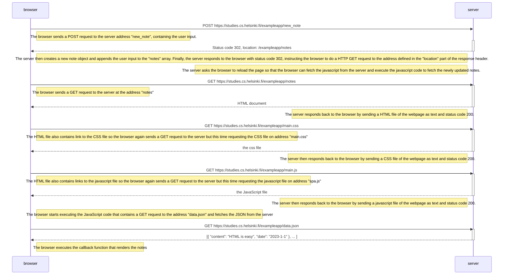

```mermaid
sequenceDiagram
    participant browser
    participant server

    browser->>server: POST https://studies.cs.helsinki.fi/exampleapp/new_note
    Note right of browser: The browser sends a POST request to the server address "new_note", containing the user input. 

    activate server
    server-->>browser: Status code 302, location: /exampleapp/notes
    deactivate server

     Note left of server: The server then creates a new note object and appends the user input to the "notes" array. Finally, the server responds to the browser with status code 302, instructing the browser to do a HTTP GET request to the address defined in the "location" part of the response header.

    Note left of server: The server asks the browser to reload the page so that the browser can fetch the javascript from the server and execute the javascript code to fetch the newly updated notes.
    
    browser->>server: GET https://studies.cs.helsinki.fi/exampleapp/notes
    activate server

    Note right of browser: The browser sends a GET request to the server at the address "notes"
    server-->>browser: HTML document
    deactivate server

    Note left of server: The server responds back to the browser by sending a HTML file of the webpage as text and status code 200.


    browser->>server: GET https://studies.cs.helsinki.fi/exampleapp/main.css
    activate server

    Note right of browser: The HTML file also contains link to the CSS file so the browser again sends a GET request to the server but this time requesting the CSS file on address "main.css" 
    server-->>browser: the css file
    deactivate server

    Note left of server: The server then responds back to the browser by sending a CSS file of the webpage as text and status code 200.

    browser->>server: GET https://studies.cs.helsinki.fi/exampleapp/main.js
    activate server

    Note right of browser: The HTML file also contains links to the javascript file so the browser again sends a GET request to the server but this time requesting the javascript file on address "spa.js" 
    server-->>browser: the JavaScript file
    deactivate server

    Note left of server: The server then responds back to the browser by sending a javascript file of the webpage as text and status code 200.

    Note right of browser: The browser starts executing the JavaScript code that contains a GET request to the address "data.json" and fetches the JSON from the server

    browser->>server: GET https://studies.cs.helsinki.fi/exampleapp/data.json
    activate server
    server-->>browser: [{ "content": "HTML is easy", "date": "2023-1-1" }, ... ]
    deactivate server

    Note right of browser: The browser executes the callback function that renders the notes
```