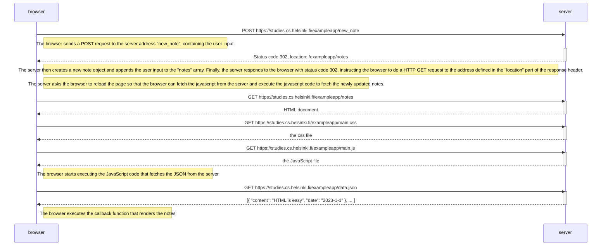

```mermaid
sequenceDiagram
    participant browser
    participant server

    browser->>server: POST https://studies.cs.helsinki.fi/exampleapp/new_note
    Note right of browser: The browser sends a POST request to the server address "new_note", containing the user input. 

    activate server
    server-->>browser: Status code 302, location: /exampleapp/notes
    deactivate server

     Note right of browser: The server then creates a new note object and appends the user input to the "notes" array. Finally, the server responds to the browser with status code 302, instructing the browser to do a HTTP GET request to the address defined in the "location" part of the response header.

    Note right of browser: The server asks the browser to reload the page so that the browser can fetch the javascript from the server and execute the javascript code to fetch the newly updated notes.
    
    browser->>server: GET https://studies.cs.helsinki.fi/exampleapp/notes
    activate server
    server-->>browser: HTML document
    deactivate server

    browser->>server: GET https://studies.cs.helsinki.fi/exampleapp/main.css
    activate server
    server-->>browser: the css file
    deactivate server

    browser->>server: GET https://studies.cs.helsinki.fi/exampleapp/main.js
    activate server
    server-->>browser: the JavaScript file
    deactivate server

    Note right of browser: The browser starts executing the JavaScript code that fetches the JSON from the server

    browser->>server: GET https://studies.cs.helsinki.fi/exampleapp/data.json
    activate server
    server-->>browser: [{ "content": "HTML is easy", "date": "2023-1-1" }, ... ]
    deactivate server

    Note right of browser: The browser executes the callback function that renders the notes
```