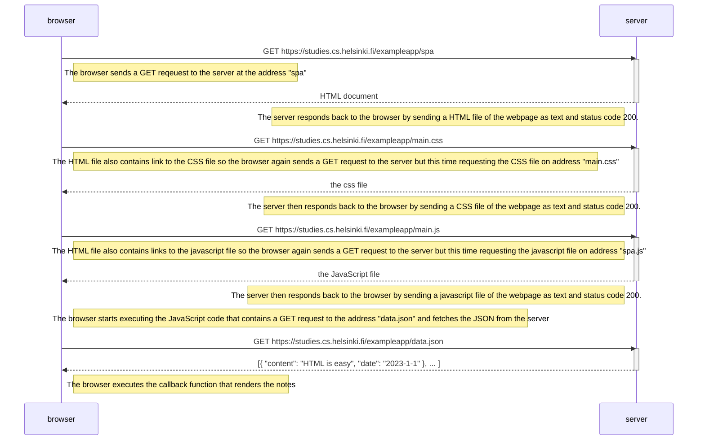

```mermaid
sequenceDiagram
    participant browser
    participant server
    
    browser->>server: GET https://studies.cs.helsinki.fi/exampleapp/spa
    activate server

    Note right of browser: The browser sends a GET reqeuest to the server at the address "spa"
    server-->>browser: HTML document
    deactivate server

    Note left of server: The server responds back to the browser by sending a HTML file of the webpage as text and status code 200.


    browser->>server: GET https://studies.cs.helsinki.fi/exampleapp/main.css
    activate server

    Note right of browser: The HTML file also contains link to the CSS file so the browser again sends a GET request to the server but this time requesting the CSS file on address "main.css" 
    server-->>browser: the css file
    deactivate server

    Note left of server: The server then responds back to the browser by sending a CSS file of the webpage as text and status code 200.

    browser->>server: GET https://studies.cs.helsinki.fi/exampleapp/main.js
    activate server

    Note right of browser: The HTML file also contains links to the javascript file so the browser again sends a GET request to the server but this time requesting the javascript file on address "spa.js" 
    server-->>browser: the JavaScript file
    deactivate server

    Note left of server: The server then responds back to the browser by sending a javascript file of the webpage as text and status code 200.

    Note right of browser: The browser starts executing the JavaScript code that contains a GET request to the address "data.json" and fetches the JSON from the server

    browser->>server: GET https://studies.cs.helsinki.fi/exampleapp/data.json
    activate server
    server-->>browser: [{ "content": "HTML is easy", "date": "2023-1-1" }, ... ]
    deactivate server

    Note right of browser: The browser executes the callback function that renders the notes
```